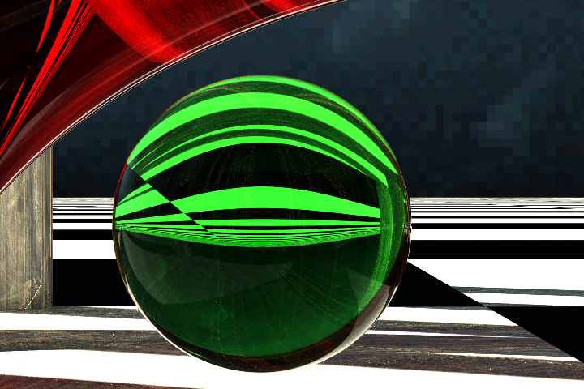
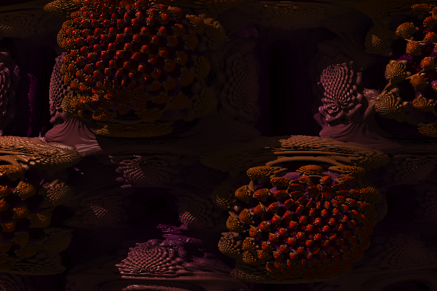
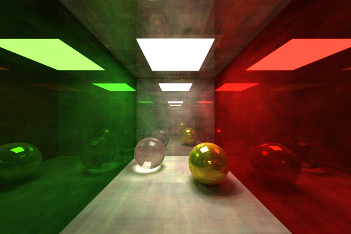
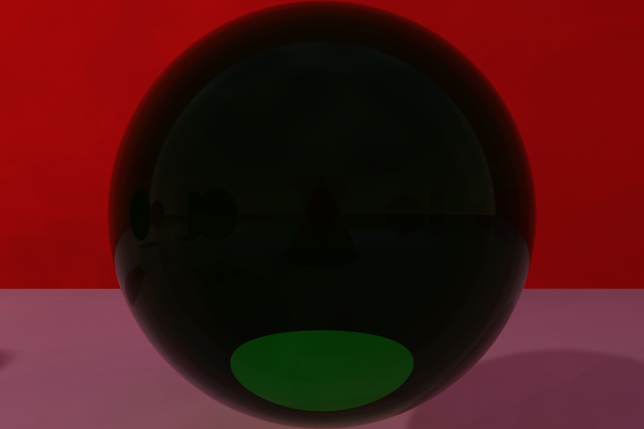
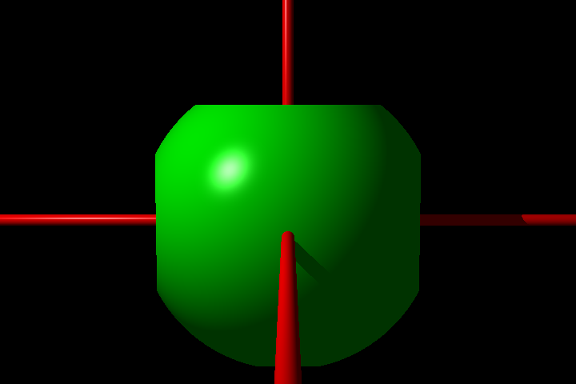
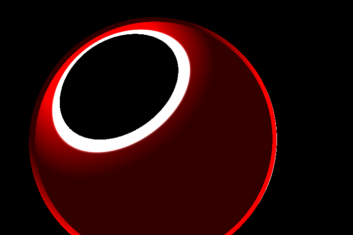
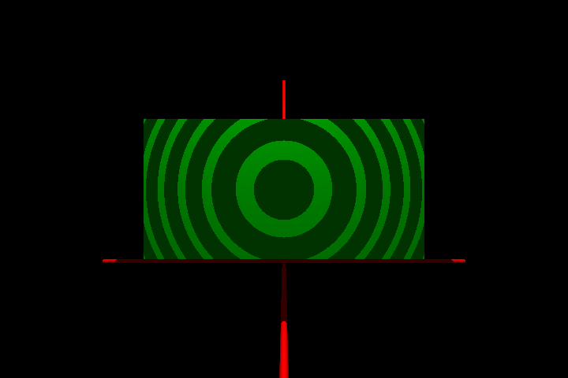
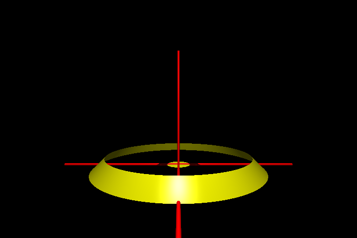

# miniRT - Raytracing Engine

## Language : C
Ce projet a été réalisé dans le cadre du cursus à l'école **42 Paris**.

**miniRT** est un moteur de rendu hybride développé en C avec la **MinilibX**.

Ce projet implémente un pipeline de rendu combinant **Raytracing**, **Path Tracing** (Monte Carlo) et **Raymarching** (SDF), permettant de générer des images photoréalistes utilisant des matériaux PBR.

---

## Installation et Compilation

Cloner le repo :

```sh
git clone git@github.com:ton_pseudo/miniRT.git miniRT && cd miniRT
```

**Prérequis**
* Une machine sous Linux ou MacOS
* ```make```, ```gcc```
* Les bibliothèques X11

**MinilibX**

Le moteur graphique repose sur la MinilibX.

Si elle n'est pas présente sur votre système :
1. Cloner la MinilibX dans le dossier racine :
	```bash
	git clone [https://github.com/42paris/minilibx-linux.git](https://github.com/42paris/minilibx-linux.git) minilibx
	```
2. La compilation de la MinilibX est gérée automatiquement par le Makefile du projet.

## **Compilation**

Générer l'exécutable standard (Raytracing pur - Partie Mandatory) :
```bash
make
```

Générer l'exécutable avancé (PBR, Path Tracing, Fractales - Partie Bonus) :
```bash
make bonus
```

Commandes de nettoyage :
```bash
make clean			# Supprime les objets
make fclean			# Supprime objets et exécutables
make re				# Recompile le mandatory
make re_bonus		# Recompile le bonus
```

Autre :
```bash
make valgrind		# Execute avec valgrind (Prend ARGS)
make valgrind_bonus # Execute le bonus avec valgrind (prend ARGS)
make help			# Affiche les options
```

## **Utilisation**

Le programme prend en argument un fichier de scène ```.rt```.

### **Mode Mandatory :**
```bash
./miniRT <scene.rt>
```

### **Mode Bonus :**
```bash
./miniRT_bonus <scene_bonus.rt> [options]
```

**Options et Arguments**
|Flag   |Argument           |Description                                                                                |
|-------|-------------------|-------------------------------------------------------------------------------------------|
|--save |```<fichier.bmp>```|Lance le rendu et sauvegarde automatiquement l'image au format BMP dans le chemin spécifié.|
|--debug|```<MODE>```       |Active un mode de visualisation spécifique pour le débogage.                               |

**Modes de debug :**
* ```SHADE``` : Rendu standard (par défaut).
* ```NORMAL``` : Visualise les normales.
* ```AO``` : Visualise l'Ambient Occlusion.
* ```LIGHTS``` : Visualise uniquement l'impact direct des sources lumineuses.
* ```SHADOWS``` : Affiche les masques d'ombres.
* ```UV``` : Visualise les coordonnées de texture.
* ```CHECKER``` : Applique un damier de test sur tous les objets.

### **Exemples**
```bash
./miniRT assets/scenes/mandatory/exemple.rt

./miniRT_bonus assets/scenes/bonus/exemple.rt

./miniRT_bonus assets/scenes/bonus/scene_complexe.rt --save rendu_final.bmp

./miniRT_bonus assets/scenes/bonus/test_texture.rt --debug UV
```

## **Contrôles et UX**

L'interface permet de naviguer en temps réel (lentement cependant).

###  Clavier

| Touche | Action |
| :--- | :--- |
| **Z / S** | Avancer / Reculer (Zoom) |
| **Q / D** | Translation Gauche / Droite |
| **A / E** | Monter / Descendre |
| **Flèches** | Rotation de la caméra (Look around) |
| **TAB** | Basculer entre mode **Translation** et **Rotation** |
| **Space** | Cycler entre les Caméras / Lumières actives |
| **C** | Sélectionner la **Caméra** |
| **L** | Sélectionner une **Lumière** |
| **I** | Afficher les infos de l'élément sélectionné (Objet/Cam/Light) |
| **T** | Activer/Désactiver l'objet ou la lumière sélectionné(e) |
| **R** | Réinitialiser la position de la caméra actuelle |
| **Shift + R** | Réinitialiser toute la scène |
| **Enter** | Prendre une capture d'écran (`output.bmp`) |
| **ESC** | Quitter le programme |

### Souris & Molette

| Action | Contexte | Effet |
| :--- | :--- | :--- |
| **Clic Gauche** | Global | Sélectionner un objet (Raycasting) |
| **Molette** | Caméra | Ajuster le **FOV** (Champ de vision) |
| **Molette** | Objet | Redimensionnement uniforme (Scale) |
| **Shift + Molette** | Objet | Redimensionnement sur l'axe **X** |
| **Ctrl + Molette** | Objet | Redimensionnement sur l'axe **Y** |
| **Alt + Molette** | Objet | Redimensionnement sur l'axe **Z** |

### Modes de Debug

Les touches **1** à **7** permettent de visualiser les différentes passes du rendu :

* **1** : Mode Standard (Shading final)
* **2** : Normales (XYZ -> RGB)
* **3** : Ambient Occlusion (AO)
* **4** : Lumières directes (Sans textures)
* **5** : Masque d'ombres (Shadows)
* **6** : Coordonnées UV
* **7** : Pattern Checker (Vérification UV)

## **Fonctionnalités du Moteur**
Ce moteur a été conçu pour explorer le rendu logiciel en C.

Il permet de modeliser plusieurs type de primites:
SPhere, cone, cylindre, box, rectangle, plan, tore, triangle, disk

### **Architecture & Performance**
* **Multi-threading** : Utilisation de tous les cœurs CPU disponibles.
* **BVH** (Bounding Volume Hierarchy) : Accélération des intersections rayons/objets.
* **Culling** : Occlusion Culling et Back-Face Culling.
* **Anti-Aliasing** : Supersampling (SSAA) et accumulation temporelle (Path Tracing).

### **Éclairage & PBR**
* **Modèles BRDF** :
  * **Lambert** (Diffuse standard).
  * **Oren-Nayar** (Surfaces rugueuses réalistes, ex: Argile, Lune).
  * **Cook-Torrance** (Micro-facettes spéculaires pour métaux/plastiques).
  * **Dielectric** : Gestion de la réfraction (Verre, Eau, Diamant).
* **Matériaux** :
  * **Conductor** : Métaux avec absorption (Or, Argent, Cuivre).
  * **Absorption** Volumétrique : Loi de Beer-Lambert pour les verres colorés.
* **Lumières** :
  * **Soleil**, **Point Light**, **Spotlight**.
  * **Quad Lights** (Lumières surfaciques).
* **Global Illumination** : Color Bleeding et éclairage indirect via Path Tracing.
* Calcul de l'**Ambient Occlusion** (AO) via Monte Carlo.
* Calcule des **Soft Shadows**.

### **Géométrie & Fractales (SDF)**

Le moteur intègre auusi un raymarcher pour les Signed Distance Functions :
* **Fractales 3D** : Mandelbulb, Mandelbox, Ensemble de Julia (4D), Éponge de Menger.
* Calcul d'**AO**.
* Calcul des **Soft Shadows**.

### **Matériaux & Textures**
* Textures : Support ```.xpm``` (Normal map, Reflexion map, Roughness map, Emission map).
* Matériaux Émissifs : Les objets peuvent devenir des sources de lumière (Pathtracing only).

---

## **Galerie**

### 1. **Rendu PBR & Matériaux**


**Figure 1.** Cornell Box PBR.


**Figure 2.** Sphere avec texture de la terre (et normal/emission/roughness map).


**Figure 3.** Terre face au solei avec Anti-Aliasing.

### 2. **Fractales & Raymarching**


**Figure 4.** Zoom sur structure Mandelbulb.


**Figure 5.** Mandelbox.


**Figure 6.** Exploration de l'ensemble de Julia 4D.

### 3. **Pathtracing**


**Figure 7.** Bille de verre transparence colorée.



**Figure 8.** Cornell Box mirroirs en Path Tracing.



**Figure 8.** Cornell Box classique en Path Tracing.

### 4. **Fails**
Le développement d'un moteur graphique passe par beaucoup d'essais... et d'erreurs artistiques.








---

## **Tests et Validation**

Un script de test automatisé est fourni pour valider le parsing des fichiers ```.rt``` et ```.mtl```.

Lancer les tests de la partie obligatoire :
```bash
./tester.sh
```

Lancer les tests complets (incluant les bonus et matériaux) :
```bash
./tester.sh --bonus
```

---

# **Ressources et Inspirations**

🔹 Peter Shirley - Série de livres Ray Tracing in One Weekend.
🔹 Inigo Quilez - Articles sur les SDF et le Raymarching de fractales.
🔹 Scratchapixel - Théorie mathématique.
🔹 Mon frère - Inspiration since 1999.

---

# Auteurs

Projet réalisé par :
* @eraad
* @jehubert

---

Note : Ce projet respecte la Norme 42.